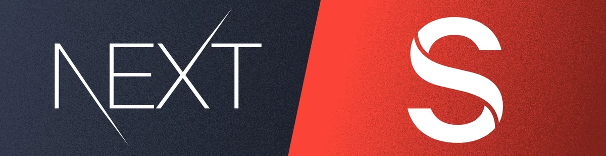

# My Blog

## A headless CMS using [Next.js](https://nextjs.org/) and [Sanity](https://www.sanity.io/)



This is a [Next.js](https://nextjs.org/) project bootstrapped with [`create-next-app`](https://github.com/vercel/next.js/tree/canary/packages/create-next-app).
This is also a [Sanity CMS](https://www.sanity.io/) project with a Sanity content editing suite embedded in the app.

## Getting Started

### Install

1. `Fork` and `clone` this repository.
2. Cd into the `my-blog` directory and run `npm install`.
3. Start the development server by typing `npm run dev`.
4. Go to [`http://localhost:3000`](http://localhost:3000) in the browser to see the project. It will throw an error because we haven't added the environment variables, so let's do that.

### Set up evironment variables

1. Go to [`Sanity.io`](https://www.sanity.io/) and click on `Get Started` to sign up for a **free account**.
   Then go to your new account, create a new `dataset` and copy your `project id`.
2. Create a new file in the project `root` called `.env.local`.
3. Create an environment variable called `NEXT_PUBLIC_SANITY_PROJECT_ID` and paste in the `project id` as the value.
4. Create two more environment variables called `NEXT_PUBLIC_SANITY_DATASET` and `NEXT_PUBLIC_SANITY_API_VERSION`. Their values are `production` and `v2023-12-12` respectively. For more information about versioning Sanity projects, check out [this article](https://www.sanity.io/docs/api-versioning).
5. Head back over to [`Sanity`](https://www.sanity.io/) and navigate to the `API` tab on your account.
6. Add `http://localhost:3000` to the `CORS origins`.
7. While still on the API tab, add two API tokens: `read` and `write`. Make sure you copy them to a safe place because you won't be able to see them again.
8. Now create two more environment variables called `SANITY_API_READ_TOKEN` and `SANITY_API_WRITE_TOKEN`. and paste in your tokens.
9. Lastly, create one more environment variable called `NEXT_PUBLIC_NODE_ENV` and set its value to `development`.

When you're done the `.env.local` file should look like this:

```javascript
NEXT_PUBLIC_SANITY_PROJECT_ID = '<your_project_id>';
NEXT_PUBLIC_SANITY_DATASET = 'production';
NEXT_PUBLIC_SANITY_API_VERSION = 'v2023-12-12';
SANITY_API_READ_TOKEN = '<your_sanity_read_token>';
SANITY_API_WRITE_TOKEN = '<your_sanity_write_token>';
NEXT_PUBLIC_NODE_ENV = 'development';
```

Restart the development server, and go back to [`http://localhost:3000`](http://localhost:3000) to see the result.
Go to [`http://localhost:3000/studio`](http://localhost:3000/studio) to use the editing suite.

## Caveats

- The blog is dynamic, but all of the page text is hard-coded. I plan to change this in the future, but for now, you will have to edit the headlines and bio text in the project and not in Sanity. You can easily add schemas for them and drop the fields in the appropriate places.
- The bio is intentionally short. Should you want a longer one, consider adding an **About** page and linking to it from the synopsis. Don't make the homepage bio any longer as it will wreck the layout.
- Currently, there is no feature to get **notifications** when someone submits the contact form, so you have to check the studio regularly. It's on my to-do list.
- I removed the **visual editing** feature from the studio because I don't use it because it's just an extra layer and it does tell me anything that I don't already know. If you want to use it, here's a tutorial on how to [implement it](https://www.sanity.io/guides/nextjs-app-router-live-preview). I was thinking that it would be cool to use it for editing social media posts &mdash; like a template for a Twitter card and Facebook post.
- There is currently **no** on-page SEO. There's a **dynamic sitemap generator** and a `robots.txt` file. But I haven't gotten around to adding fields for meta-tags to any of the pages or posts. I also need to add `JSON-LD` structured data. It's a very high priority, but it isn't done. The Next.js 14 documentation has a comprehensive [guide to optimization](https://nextjs.org/docs/app/building-your-application/optimizing). If you feel like tackling this yourself, I would appreciate it if you'd do it as a **Pull Request** so I can enjoy the fruits of your labor. 😂

Here's a list of features I want to add:

- animate the nav bar and page transitions
- use skeletons instead of spinners
- an inbox with notifications for the contact form submissions
- breadcrumbs to posts
- a sidebar on post pages with recent or featured posts
- a lead magnet on the sidebar
- social share buttons on posts
- a little mini-bio on the sidebar

## Learn More

To learn more about Next.js and Sanity CMS, take a look at the following resources:

- [Next.js Documentation](https://nextjs.org/docs) - learn about Next.js features and API.
- [Learn Next.js](https://nextjs.org/learn) - an interactive Next.js tutorial.
- [Sanity Documentation](https://www.sanity.io/docs) - learn about Sanity features and API.
- [The official Sanity toolkit for Next.js](https://www.sanity.io/plugins/next-sanity) - learn about integrating Sanity with Next.js using the `next-sanity` package

You can check out [the Next.js](https://github.com/vercel/next.js/), [Sanity](https://github.com/sanity-io/sanity), and [next-sanity](https://github.com/sanity-io/next-sanity) GitHub repositories.

## Deploy on Vercel

The easiest way to deploy this project is to use the [Vercel Platform](https://vercel.com/new?utm_medium=default-template&filter=next.js&utm_source=create-next-app&utm_campaign=create-next-app-readme) from the creators of Next.js.

Check out the [Next.js deployment documentation](https://nextjs.org/docs/deployment) for more details.
